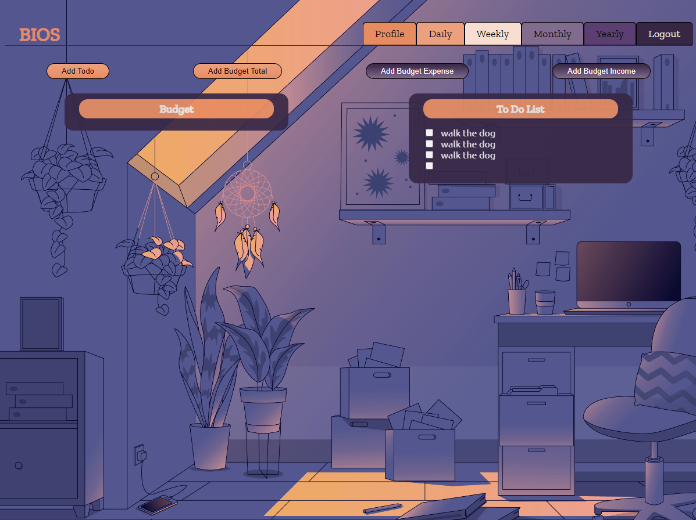

# bios-todos

## Description
An application where you can track your recurring todos for daily tasks, weekly, monthly, and yearly. As well as a budgeting section to keep track of your finances throughout the year! Utilizing Apollo Graph QL and MongoDB for the back end and React for the front end.  This application features login persistance as well as a beautiful UI.

## Built With
* JavaScript
* React
* MongoDB
* Mongoose.js
* Express.js
* Node.js
* Apollo GraphQL
* CSS
* JWT
* Concurrently.js

## Usage
This application can be used by anyone looking to get more organized. You can find our deployed application: [here](https://biostodos.herokuapp.com/)

## Contribution
[Bryan Nolasco](https://github.com/bryannolasco11)
[Ocean Veliz](https://github.com/oceanlatte)
[Ian Zimmers-Kraft](https://github.com/TheTrueZK)
[Stephanie Russow](https://github.com/TheTrueZK)
